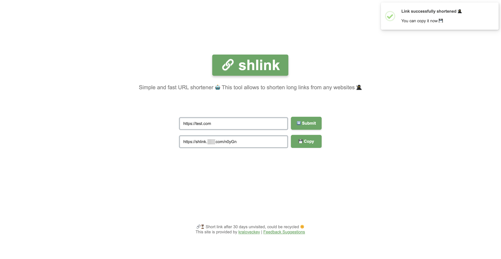

# shlink

## Overview

The definitive self-hosted, simple and fast URL shortener. This tool allows to shorten long links from any websites.

The name is an abbreviation for `short link`, but if you get the words `shrink` and `link` together, the result is `shlink` too.

## Installation & Configuration

### Environment preparation

- `PHP 8.x`
- `Nginx`
- `MySQL 8.x`

### Configuration changes

Modify the configuration of `config.php`.

### Nginx

The contents of `nginx-rewrite.conf` need to be added to the `Nginx` configuration file.

Or use the full configuration file `nginx-shlink.conf`.

### MySQL

```sql
mysql> CREATE DATABASE shlink_db DEFAULT CHARACTER SET utf8mb4 COLLATE utf8mb4_unicode_ci;

mysql> CREATE USER 'shlink'@'localhost' IDENTIFIED BY 'STRONG_PASSWORD';

mysql> GRANT ALL PRIVILEGES ON shlink_db.* TO 'shlink'@'localhost';

mysql> USE shlink_db;

mysql> CREATE TABLE `urls` (
  `uid` mediumint(8) unsigned NOT NULL auto_increment,
  `id` VARCHAR(10),
  `data` text,
  `time` datetime,
  PRIMARY KEY  (`uid`)
) ENGINE=MyISAM  DEFAULT CHARSET=utf8;

mysql> FLUSH PRIVILEGES;

mysql> exit
```

## Functions

- Long to short links.
- Simple interface.
- One click copy.
- Link validity time.

### Example

